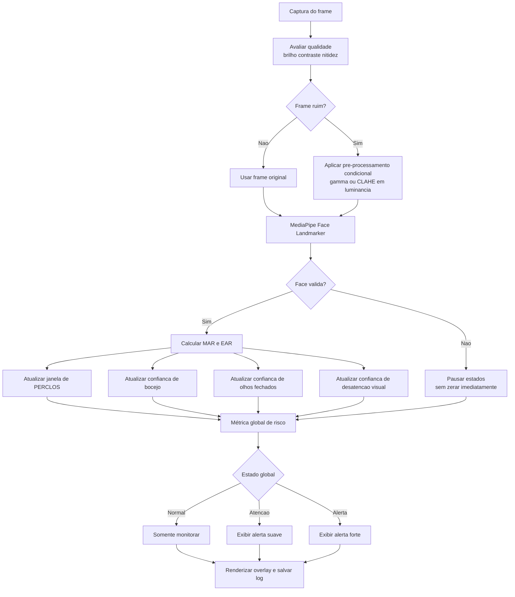

# TODO - Pipeline robusto para sonolencia e desatencao

## Objetivo

Construir um pipeline unico, usando `new.py` como base, para detectar sonolencia e desatencao a partir de caracteristicas faciais com MediaPipe e OpenCV.

O sistema deve:

- usar `MAR`, `EAR` e `PERCLOS` como sinais principais;
- considerar tambem direcao do olhar como sinal complementar de desatencao;
- evitar falsos positivos e oscilacoes rapidas;
- confirmar eventos em janelas temporais de aproximadamente `3 a 5 segundos`;
- aplicar pre-processamento apenas quando a qualidade do frame exigir isso.

---

## Resumo da arquitetura planejada

Em vez de disparar alerta por frame, o pipeline deve funcionar em camadas:

1. captura do frame;
2. analise da qualidade do frame;
3. pre-processamento condicional;
4. deteccao de landmarks com MediaPipe;
5. calculo das metricas faciais;
6. atualizacao de estados temporais por metrica;
7. agregacao em um risco global;
8. emissao de alertas com histerese e cooldown;
9. exibicao e registro dos dados.

---

## Diagrama do fluxo



---

## Diretriz principal de implementacao

Nao usar um threshold simples em cada frame como decisao final.

Em vez disso, cada metrica deve gerar uma `confianca temporal` entre `0.0` e `1.0`.
Essa confianca sobe quando a evidencia persiste e cai gradualmente quando a evidencia desaparece.

Depois disso, um agregador global combina as confiancas em um estado final de risco.

Essa abordagem e melhor que:

- disparar alerta diretamente por valor instantaneo;
- fazer uma media ponderada dos valores crus antes de estabilizar cada fenomeno.

---

## Ordem recomendada de trabalho

## Etapa 1 - Consolidar a base do projeto

### Sugestoes

- Primeiro estabilize a arquitetura no mesmo arquivo.
- So depois considere quebrar em modulos como `metrics.py`, `quality.py`, `state.py` e `alerts.py`.

### Resultado esperado

- Um unico ponto de entrada para todo o sistema.

---

## Etapa 2 - Criar uma camada explicita de estado temporal

### O que fazer

Criar uma estrutura de estado para cada metrica:

- `yawn_state`
- `eye_closure_state`
- `perclos_state`
- `gaze_state`
- `global_risk_state`

Cada estado deve armazenar:

- valor bruto atual;
- valor suavizado;
- historico curto para media movel ou EMA;
- historico temporal em segundos;
- confianca atual entre `0.0` e `1.0`;
- cooldown;
- tempo desde o ultimo evento valido;
- indicador de disponibilidade da face.

### Sugestao de regra de atualizacao

Para cada frame, calcular uma `evidencia` entre `0.0` e `1.0` para a metrica e atualizar a confianca com subida mais rapida que a descida.

Exemplo simples:

```text
confianca_nova = clip(
    confianca_antiga + ganho_subida * evidencia - ganho_descida * (1 - evidencia),
    0.0,
    1.0
)
```

### Sugestoes iniciais

- `ganho_subida` maior para sinais criticos, como olhos fechados prolongados.
- `ganho_descida` menor para evitar oscilacao rapida.
- quando a face sumir por poucos frames, congelar ou degradar lentamente o estado em vez de zerar tudo.

### Resultado esperado

- O sistema deixa de responder apenas ao frame atual e passa a responder a persistencia do comportamento.

---

## Etapa 3 - Definir a semantica de cada metrica

### 3.1 MAR e bocejo

### O que fazer

- Continuar usando `MAR` para medir abertura da boca.
- Separar `boca aberta` de `bocejo`.
- Exigir amplitude alta e persistencia para chamar de bocejo.

### Sugestao pratica

- `MAR_OPEN_THRESHOLD`: indica boca aberta, mas nao bocejo.
- `MAR_YAWN_LIKE_THRESHOLD`: abertura forte.
- `MIN_YAWN_FRAMES` ou tempo equivalente em segundos: confirma bocejo apenas se a abertura forte persistir.
- aplicar cooldown apos detectar bocejo.

### Cuidado importante

Fala pode abrir bastante a boca por alguns frames. Por isso bocejo deve depender de:

- amplitude;
- persistencia;
- talvez curva de abertura e fechamento mais lenta que a fala.

### 3.2 EAR e fechamento ocular

### O que fazer

- Continuar usando `EAR` como sinal instantaneo de fechamento ocular.
- Diferenciar piscada normal de olhos fechados por tempo anormal.

### Sugestao pratica

- `EAR_CLOSED_THRESHOLD`: limiar de olho fechado.
- usar suavizacao curta para reduzir jitter.
- so considerar `olhos fechados` apos alguns frames consecutivos.

### Cuidado importante

Piscada normal nao deve elevar o risco global de forma forte.
O risco deve subir quando o fechamento durar mais do que uma piscada comum.

### 3.3 PERCLOS

### O que fazer

- Manter uma janela deslizante de tempo real para PERCLOS.
- Alimentar essa janela com um estado binario ou probabilistico de olhos fechados.

### Sugestao pratica

- janela inicial: `20 segundos`;
- gerar alerta de fadiga apenas quando a janela estiver suficientemente preenchida;
- usar `PERCLOS` como o principal sinal acumulado de sonolencia.

### Cuidado importante

`PERCLOS` nao deve disparar cedo demais quando o sistema ainda esta aquecendo ou quando a face acabou de voltar.

### 3.4 Gaze e desatencao

### O que fazer

- Continuar usando a posicao horizontal da iris.
- Criar uma confianca temporal de desatencao para quando o olhar permanecer fora da zona neutra.

### Sugestao pratica

- considerar uma faixa neutra central;
- contar desatencao apenas quando o desvio persistir por tempo suficiente;
- inicialmente usar gaze como fator complementar, nao como gatilho mais severo.

### Cuidado importante

Movimentos breves de verificacao lateral nao devem ser classificados como desatencao critica.

---

## Etapa 4 - Criar o agregador global de risco

### O que fazer

Combinar as confiancas das metricas em um unico escore global.

### Sugestao inicial de pesos

Use um modelo simples e interpretavel:

```text
risco_global =
    0.45 * confianca_perclos +
    0.30 * confianca_olhos_fechados +
    0.15 * confianca_bocejo +
    0.10 * confianca_desatencao
```

### Sugestao de estados globais

- `NORMAL`
- `ATENCAO`
- `ALERTA`

### Sugestao de histerese

Exemplo:

- entra em `ATENCAO` se `risco_global >= 0.35`
- sai de `ATENCAO` so quando `risco_global < 0.25`
- entra em `ALERTA` se `risco_global >= 0.65`
- sai de `ALERTA` so quando `risco_global < 0.50`

### Por que fazer assim

Sem histerese, o sistema vai ficar alternando entre estados em transicoes curtas.

### Resultado esperado

- Alertas mais estaveis e mais explicaveis.

---

## Etapa 5 - Adicionar avaliacao de qualidade do frame

### O que fazer

Antes de rodar o MediaPipe, medir algumas propriedades do frame:

- brilho medio;
- faixa dinamica de luminancia;
- contraste;
- nitidez aproximada.

### Sugestao de metricas simples

- `mean_luma`: media da luminancia;
- `p10` e `p90`: percentis para medir faixa util de contraste;
- `dynamic_range = p90 - p10`;
- `laplacian_var`: variancia do laplaciano para detectar blur.

### Exemplo de interpretacao

- brilho baixo e faixa dinamica baixa: cena escura ou lavada;
- laplaciano muito baixo: blur ou fora de foco.

### Resultado esperado

- O sistema sabe quando o frame esta ruim antes de confiar totalmente nas metricas faciais.

---

## Etapa 6 - Aplicar pre-processamento condicional

### O que fazer

Aplicar filtros antes do MediaPipe apenas se a qualidade do frame estiver ruim.

### Sugestao de ordem de prioridade

1. tentar correcao gama em baixa luz;
2. testar `CLAHE` no canal de luminancia;
3. evitar filtros pesados que alterem a geometria da face.

### Regras praticas sugeridas

- se `mean_luma` estiver muito baixo, testar gamma menor que `1.0` para clarear;
- se a cena estiver com pouco contraste local, testar `CLAHE` em Y ou LAB;
- se a cena estiver boa, nao aplicar nada.

### Cuidado importante

Nao usar no pipeline principal os efeitos visuais de `filter2.py`, como colormap ou edges.
Eles servem para visualizacao, nao para robustez do detector facial.

### Resultado esperado

- MediaPipe mais estavel em baixa luz, sem degradar a imagem em cenarios normais.

---

## Etapa 7 - Tratar perda temporaria de face

### O que fazer

Mudar a logica atual que limpa historicos imediatamente quando a face nao e detectada.

### Sugestao pratica

- criar um contador de ausencia da face;
- tolerar uma ausencia curta, por exemplo `0.5 a 1.0 s`;
- durante essa ausencia curta, congelar ou degradar lentamente as confiancas;
- somente limpar historicos apos ausencia persistente.

### Por que fazer assim

Isso reduz falsos positivos e evita que o sistema entre em estado inconsistente por um drop momentaneo do detector.

---

## Etapa 8 - Instrumentacao e logging

### O que fazer

Salvar os dados principais por frame ou por timestamp:

- `timestamp`
- `mar_raw`
- `mar_smooth`
- `ear_raw`
- `ear_smooth`
- `perclos`
- `gaze_ratio`
- `frame_quality`
- `confidence_yawn`
- `confidence_eye_closure`
- `confidence_perclos`
- `confidence_gaze`
- `global_risk`
- `global_state`

### Sugestao pratica

- gerar CSV simples para calibracao;
- registrar tambem quando um alerta entrou e saiu.

### Resultado esperado

- Base objetiva para ajustar thresholds e pesos com dados reais.

---

## Etapa 9 - Melhorar overlay e interface de depuracao

### O que fazer

Mostrar na tela nao so os valores brutos, mas tambem o estado interno do sistema.

### Mostrar no overlay

- `MAR`, `EAR`, `PERCLOS`;
- confianca de cada metrica;
- estado de qualidade do frame;
- estado global: `NORMAL`, `ATENCAO` ou `ALERTA`;
- indicador de face ausente ou frame degradado.

### Resultado esperado

- Fica mais facil entender por que um alerta aconteceu.

---

## Etapa 10 - Plano de validacao manual

### Cenarios que precisam ser testados

1. conversa normal sem sonolencia;
2. bocejo real sustentado;
3. piscadas naturais;
4. olhos fechados por alguns segundos;
5. olhar lateral curto;
6. olhar lateral sustentado;
7. ambiente claro;
8. ambiente escuro;
9. perda parcial do rosto;
10. recuperacao da face apos falha temporaria.

### O que observar

- se o alerta demora tempo demais para entrar;
- se entra cedo demais;
- se oscila durante eventos curtos;
- se continua alto depois que o evento terminou;
- se o pre-processamento realmente melhora a deteccao em baixa luz.

---

## Sugestoes de implementacao no codigo

### Mudanca minima recomendada

Comecar evoluindo `new.py` sem reescrever tudo.

### Ordem segura

1. adicionar avaliacao de qualidade do frame;
2. adicionar pre-processamento condicional;
3. trocar a logica booleana atual por estados com confianca;
4. criar agregador global;
5. adicionar logs;
6. depois refatorar em modulos, se necessario.

### Possiveis funcoes novas

- `assess_frame_quality(frame)`
- `preprocess_frame_if_needed(frame, quality)`
- `update_yawn_state(...)`
- `update_eye_closure_state(...)`
- `update_perclos_state(...)`
- `update_gaze_state(...)`
- `update_global_risk(...)`
- `draw_debug_panel(...)`
- `write_metrics_log(...)`

---

## Parametros iniciais sugeridos

Esses valores nao sao definitivos. Sao um ponto de partida para teste.

### Temporais

- confirmacao de alerta individual: `3 a 5 s`
- tolerancia para perda de face: `0.5 a 1.0 s`
- cooldown de bocejo: manter algo proximo do valor atual e ajustar com teste real
- PERCLOS: manter `20 s` no inicio

### Prioridade dos sinais

- maior peso para `PERCLOS`
- peso alto para fechamento ocular prolongado
- peso medio para bocejo
- peso menor para gaze, pelo menos na primeira versao

### Filosofia de ajuste

- primeiro reduzir falsos positivos;
- depois recuperar sensibilidade;
- nunca ajustar tudo ao mesmo tempo.

---

## Erros que valem evitar

- usar media ponderada dos valores crus sem estabilizar cada metrica;
- zerar todo o estado ao perder a face por poucos frames;
- aplicar filtros em todos os frames sem necessidade;
- usar gaze como alerta forte logo na primeira versao;
- calibrar thresholds so no olho, sem log e sem cenarios repetiveis.

---

## Resultado final esperado

Ao final, o programa deve:

- detectar sonolencia com foco em persistencia, nao em valores instantaneos;
- reduzir oscilacoes de alerta;
- reduzir falsos positivos de fala, piscada e movimentos curtos do olhar;
- lidar melhor com baixa iluminacao;
- mostrar ao usuario por que o sistema decidiu alertar.

---

## Proximo passo recomendado

Implementar primeiro a `Etapa 2`, `Etapa 5` e `Etapa 7`, porque elas atacam diretamente a causa principal da oscilacao e dos falsos positivos.